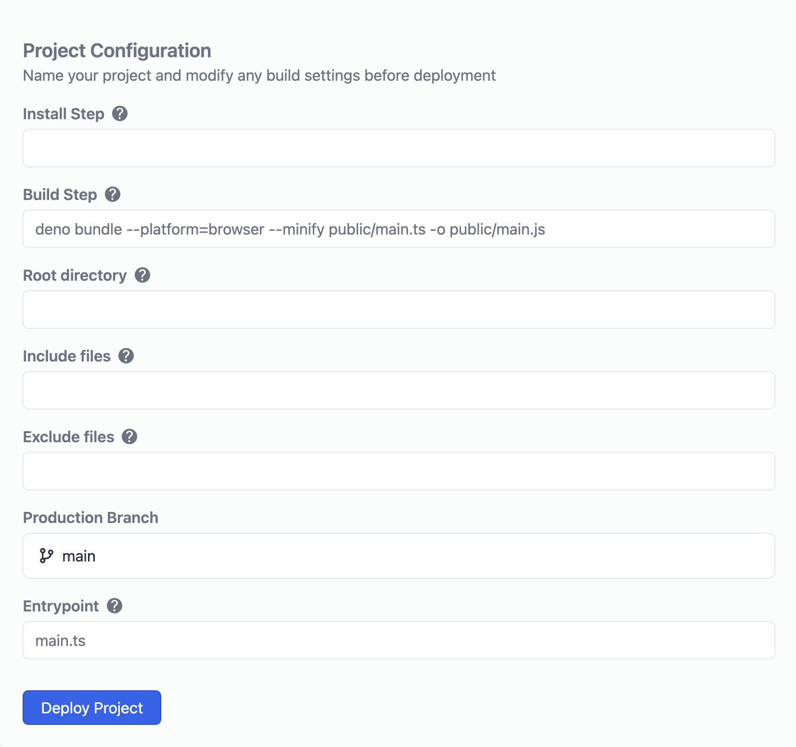

# おもかげ地図

[](https://www.typescriptlang.org/)

## 概要
ビジョン: "誰かの「いつ、どこで、何があったか」を紡ぐ地図"  
ターゲット: "地域歴史の授業時間の小学3,4年生"  
推奨環境: PC (Chrome)  

思い出のエピソードを地図上の領域の情報とともに投稿できるプラットフォームです。  
投稿される方は、思い出深い場所、今は存在しない建物の場所などとともにエピソードを共有いただけます。  


## ローカルの実行コマンド

`deno task start`でpublic/main.jsが自動生成、実行されます。

## Deno Deployのやり方

Deno Deploy：
https://dash.deno.com/account/overview

Build Stepで`deno bundle --platform=browser --minify public/main.ts -o public/main.js`を入力してください。

Entrypointは`main.ts`です。

mainブランチの場合：



## 領域データについて

送受信で扱う領域データは以下のとおり
```
{
  name: "投稿者名",
  geometry: {
    type: "Feature",
    properties: {},
    geometry: {
      type: "Polygon",
      coordinates: [
        [
          [経度_1, 緯度],[経度_2, 緯度_2], ...
        ]
      ]
    }
  },
  decade: { gt: 何年から, lte: 何年まで },
  comment: "投稿者コメント",
  photos: ["画像のパス（入れば）"],
  thread: ["第三者コメント（入れば）"],
  created_at: "作成日時"
}
```


## 実装したAPI
### GET /query-json?year=&x=&y=&x2=&y2=
指定した年代・範囲内にある領域データを取得します。
xが経度　、yが緯度です。

### POST /post-json
bodyで上記の領域データを持たせると、内容がデータベースに保存されます。

### GET /get-comments?id=
投稿に対するコメントを取得（※query-jsonでコメント付きで取得できる）

### POST /post-comments
id, comment, created_at を含むJSONを送ると、コメントがデータベースに保存されます。
